<h1 align="center">Nicotine Hub</h1>

<p align="center">
  
</p>

<p align="center">
  <a href="AI-DECLARATION.md"></a>
  <a href="https://github.com/mlnl221/nicotineHub/actions/workflows/ci.yml"></a>
  <a href="https://github.com/mlnl221/nicotineHub/releases"></a>
  <a href="LICENSE"></a>
</p>

<p align="center">
  A <strong>mobile-first</strong> web client for the <a href="https://www.slsknet.org/">Soulseek</a> network.<br/>
  <em>Built predominantly with AI assistance under human review — see <a href="AI-DECLARATION.md">AI-DECLARATION.md</a>.</em>
</p>

## Demo

<p align="center">
  <strong>Try before you install → <a href="https://nicotine-hub-web-phi.vercel.app/">https://nicotine-hub-web-phi.vercel.app/</a></strong><br/>
  No bridge required. Enter any username/password to explore search, chat, profiles &amp; browse with mocked data.<br/>
  <em>Downloads/uploads are disabled in the demo.</em>
</p>

## Screenshots

All captures from a local demo build (`NEXT_PUBLIC_DEMO=true`, mocked data) — desktop `1280×800`, mobile `390×844`.

| Desktop: search → filters → downloads → spectrum | Mobile: search → browse → downloads |
|---|---|
| 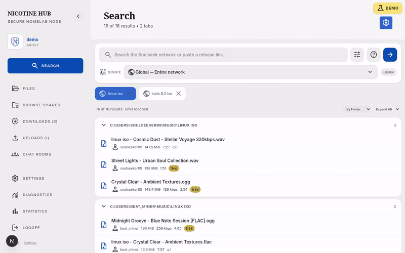 | 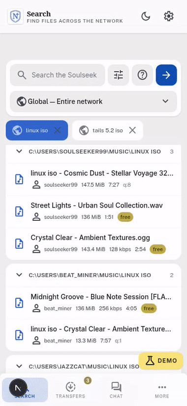 |

### Desktop

| Login | Search | Filters | Release-link paste |
|---|---|---|---|
| [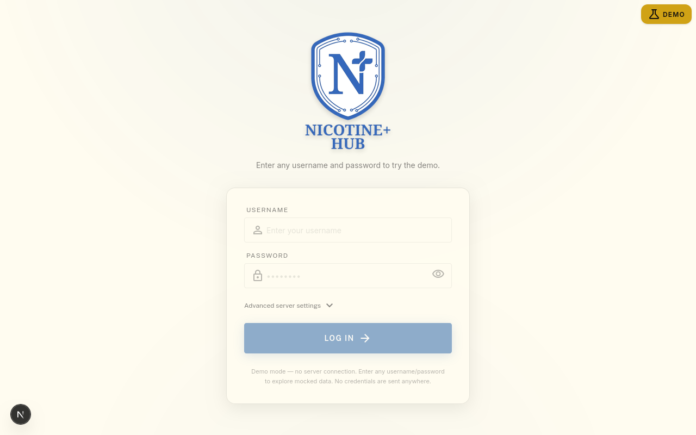](docs/screenshots/01-login.png) | [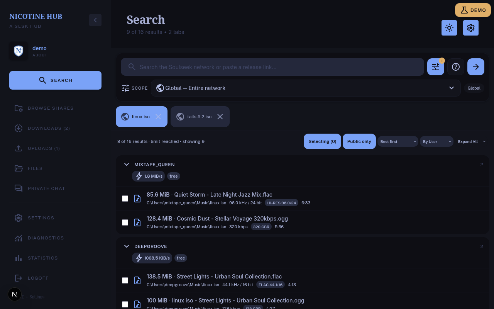](docs/screenshots/02-search.png) | [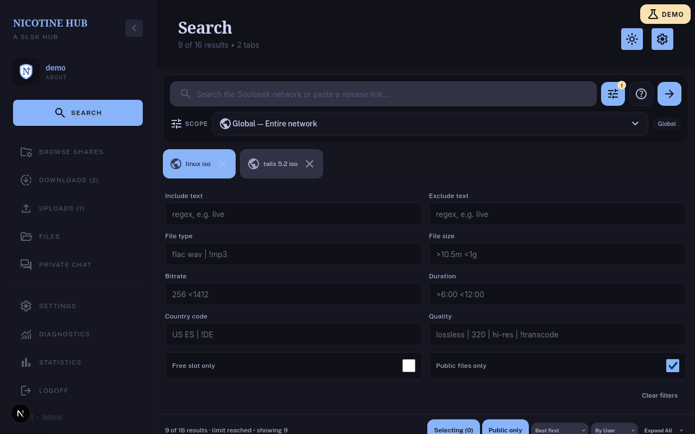](docs/screenshots/03-search-filters.png) | [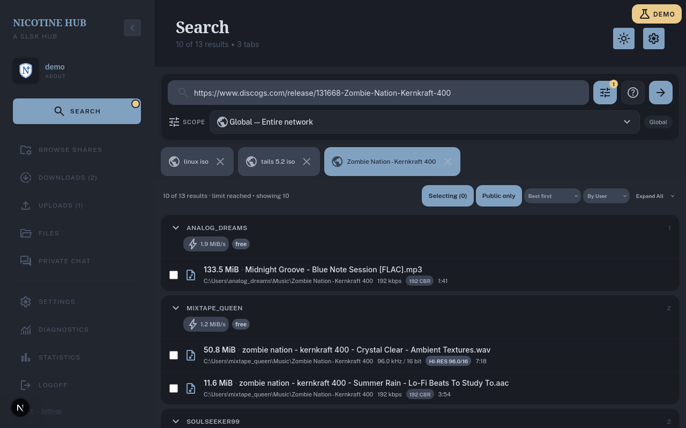](docs/screenshots/04-search-link.png) |

| Downloads | Spectrum Full | Spectrum Zoom | Browse shares |
|---|---|---|---|
| [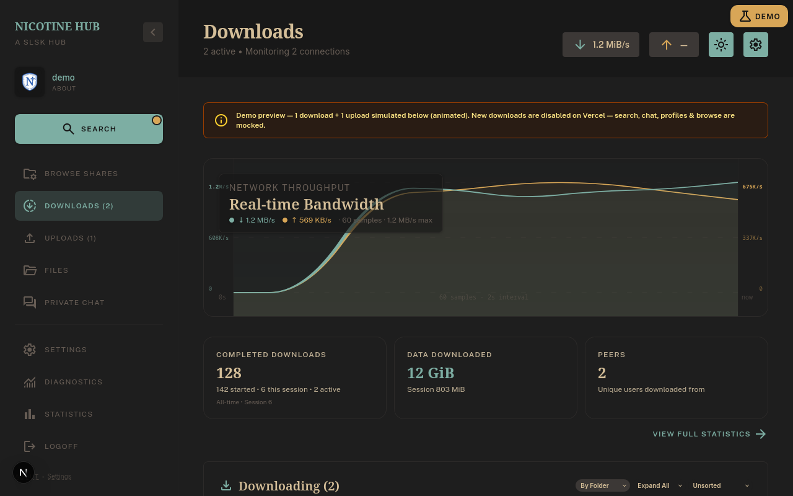](docs/screenshots/05-downloads.png) | [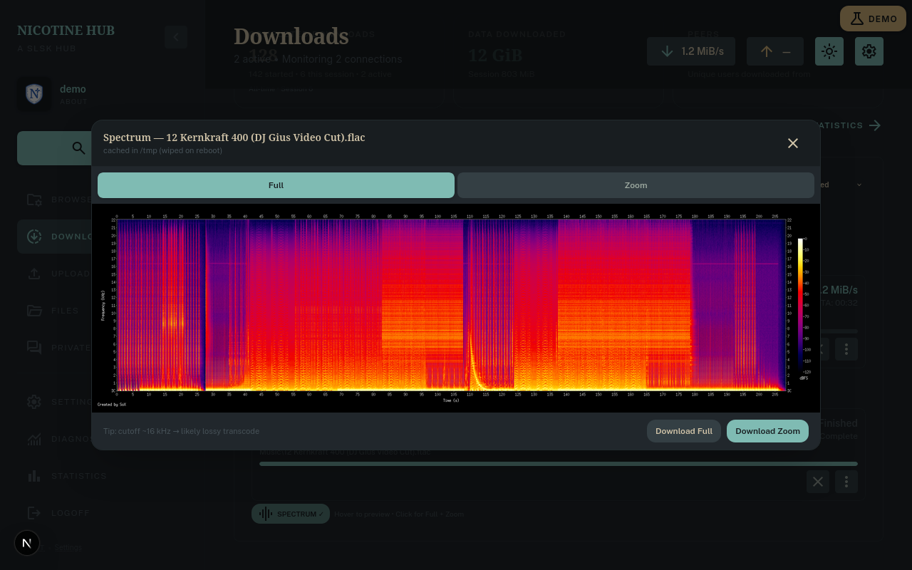](docs/screenshots/06-spectrum.png) | [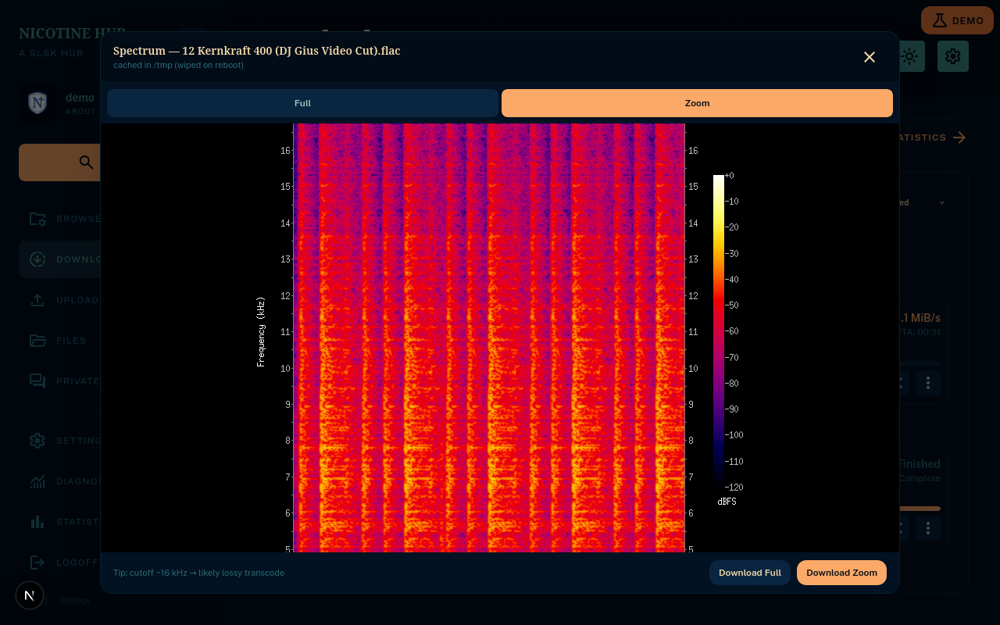](docs/screenshots/07-spectrum-zoom.png) | [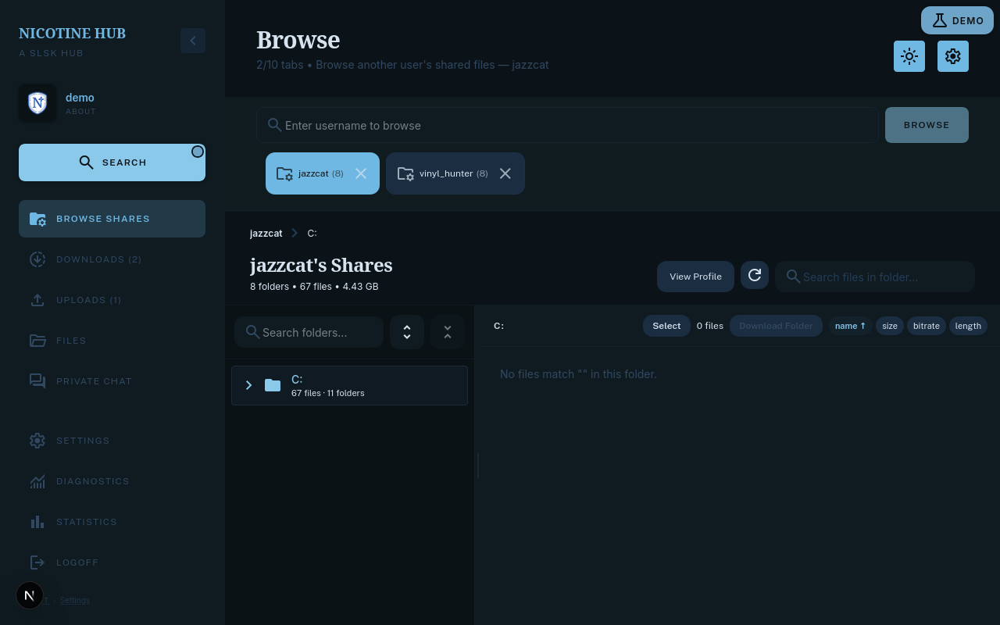](docs/screenshots/08-browse.png) |

| Chat rooms | Private chat |
|---|---|
| [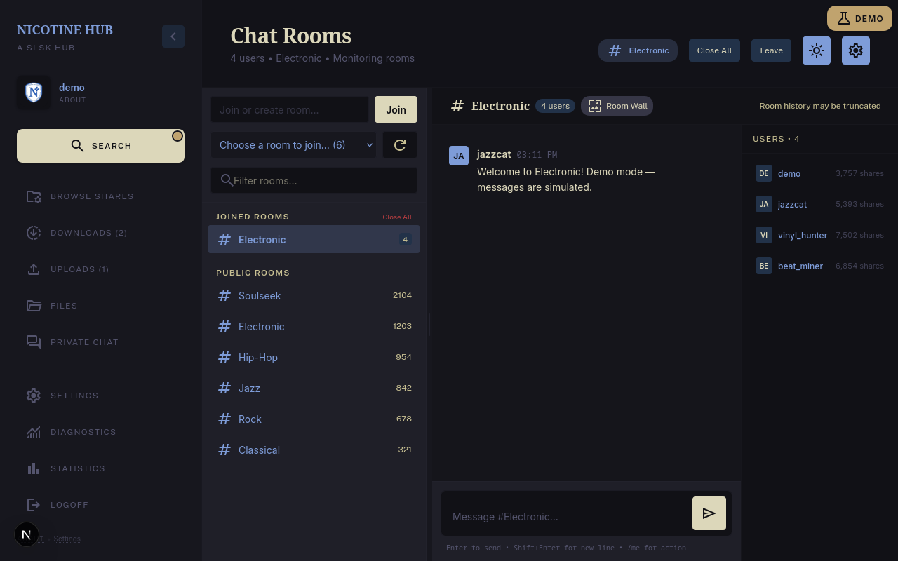](docs/screenshots/09-chat.png) | [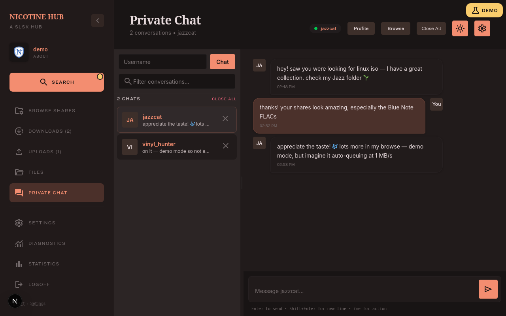](docs/screenshots/10-private-chat.png) |

### Mobile

| Search | More sheet | Downloads | Private chat |
|---|---|---|---|
| [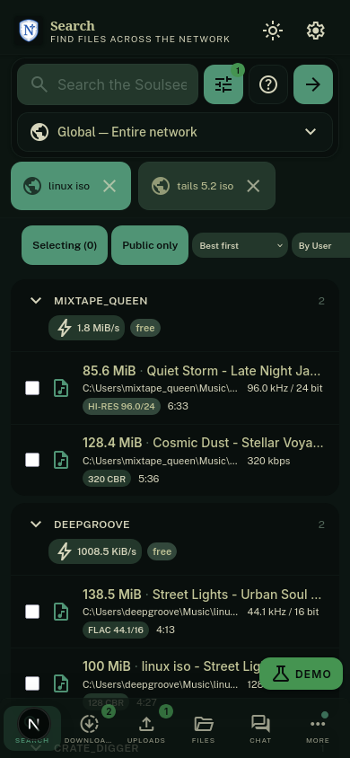](docs/screenshots/m1-search.png) | [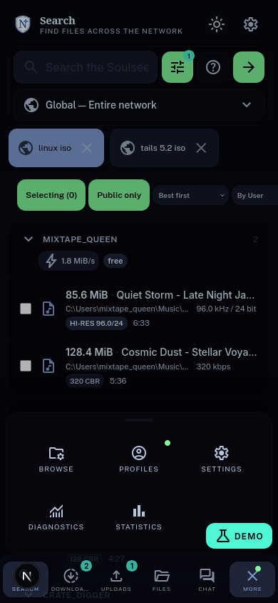](docs/screenshots/m2-more-sheet.png) | [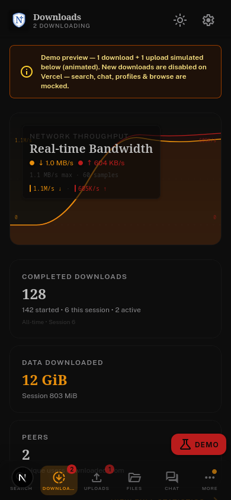](docs/screenshots/m3-downloads.png) | [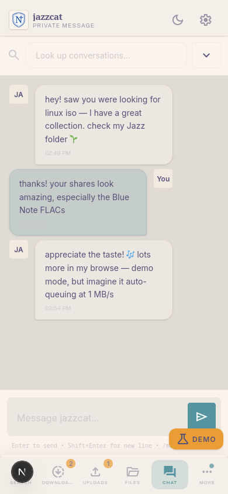](docs/screenshots/m4-chat.png) |

This is an almost 1:1 port of [nicotine-plus](https://nicotine-plus.org/) ([GitHub](https://github.com/nicotine-plus/nicotine-plus)) to a modern Next.js web app. Built on `doc/SLSKPROTOCOL.md`.

```
[ Browser (Next.js PWA) ] --WS JSON--> [ Bun bridge :8787 ] --TCP--> server.slsknet.org:2242
         |                    --HTTP--> [ Python worker :8789 ] --HTTP--> Discogs/Bandcamp/Apple/…
                                                          --P2P--> peers
```

The browser can't open raw TCP sockets, so the bridge translates JSON over WebSocket to Soulseek binary framing. Heavy work (link scraping, spectrum rendering, tagging) lives in the worker so the SLSK event loop stays clean. See `docs/architecture.md` for protocol and env details.

> **Security:** Soulseek sends passwords in plaintext. The app never stores them — use credentials you trust.

---

## Features

- **Search** — global, user, room, wishlist & buddies; tabs + live filters (size/bitrate/length/type/slot/country); paste a Discogs/Bandcamp/Apple/Qobuz/Tidal/MusicBrainz/Deezer/Beatport link to auto-identify the release (worker `POST /scrape`)
- **Transfers** — queue, resume (`INCOMPLETE<md5>`), `GET /files/:token`, throttled streaming; **Analyze Spectrum** (see below) for finished audio via worker `sox` Full 2000×513 + Zoom 500×1025 (`oxipng`, shared `/tmp` cache)
- **Worker (scrape/spectrum/tag)** — separate Python FastAPI service `:8789` for CPU/IO-heavy ops; bridge stays SLSK-only
- **Browse** — shares & folders via peers
- **Chat** — rooms + private, tickers, owned/member lists
- **Social** — buddies, interests/recommendations/similar users
- **Profiles** — description, picture, stats, privileges
- **Mobile shell** — `TopBar`/`BottomNav`, safe-area, PWA, diagnostics live tail

### Analyze Spectrum (FLAC / audio)

After a download finishes, right-click the card on **`/downloads`** → **Analyze Spectrum** (only for finished audio: `flac`, `wav`, `aiff`, `mp3`, `ogg`, …). The worker renders two PNGs (own code; output semantics match the old bridge port of [`smoked-salmon`](https://github.com/smokin-salmon/smoked-salmon) `uploader/spectrals.py`, Apache-2.0):

- **Full** `2000×513` `-z 120` Kaiser (`remix 1`) — whole file
- **Zoom** `500×1025` `-z 120` Kaiser `-S <mid> -d 0:02` — 2-second slice from the middle (like salmon’s `calculateZoomStartpoint`)

Images are `oxipng -o 2 --strip all` compressed and stored **only in `/tmp/hub-spectrum`** in the shared `spectrum-cache` volume (wiped on reboot / `docker restart`). The web shows a **badge `SPECTRUM ✓`** on the card, **hover preview** (desktop, Full) with instant cache via blob URL / `ETag`, and a **modal** with tabs for Full + Zoom, downloads, and a tip about lossy cutoffs (~16 kHz). While generating you see `Generating spectrum…`; on error the card shows the reason. See [`docs/spectrum.md`](docs/spectrum.md) and [`docs/architecture.md#transfers--spectrum`](docs/architecture.md#transfers--spectrum).

---

## Repo layout

```
apps/bridge  — Bun bridge  (WebSocket `/ws` + `/health` + `/files/:token` + volume `DATA_DIR`, SLSK-only)
apps/worker  — Python FastAPI (scrape/spectrum/tag on `:8789`, `bridge-data:/data:ro` + `spectrum-cache`)
apps/web     — Next.js 15 PWA
compose.yaml — web:3000 + bridge:8787/60754 + worker:8789 → bridge-data:/data + spectrum-cache
```

---

## Quick start

```bash
bun install
bun run dev              # bridge + web
bun test && bun run build
docker compose up --build  # http://localhost:3000 (build from source)
```

Bridge URL: `NEXT_PUBLIC_BRIDGE_URL` (build) or `localStorage.nicotineHub.bridgeUrl` (runtime). All env vars are documented in [`docs/architecture.md#env-full`](docs/architecture.md#env-full) — including `BRIDGE_TOKEN`, `DATA_DIR`, `LISTEN_PORT` (60754, editable in Settings → Network), `SHARED_DIRS`, `UPLOAD_LIMIT`, etc.

For prebuilt images and release workflow, see [`docs/deployment.md`](docs/deployment.md).

### Docker Compose

Modify accordingly if running with unRAID or setting up with Portainer.

- Logging is optional
- Host port mapping might need to be changed to not collide with other apps
- Change `BASE_DOCKER_DATA_PATH` to match your setup. Can be simply `./data`
- Set a custom network if needed
- Forward `LISTEN_PORT` `60754` TCP+UDP on your router for Soulseek searches (or use `network_mode: host` for UPnP)

Create `docker-compose.yml` and add the following. If you have an existing setup change to fit that.

```yaml
services:
  bridge:
    container_name: nicotinehub-bridge
    image: ghcr.io/mlnl221/nicotinehub-bridge:latest
    restart: unless-stopped
    ports:
      - 8787:8787
      - 60754:60754
      - 60754:60754/udp
    volumes:
      - ${BASE_DOCKER_DATA_PATH:-./data}:/data
      # - /home/you/Music:/data/Music:ro  # add shares via Settings → Shares
    environment:
      - LISTEN_PORT=60754
      # - BRIDGE_TOKEN=changeme  # optional, protects /ws + /files/:token

  worker:
    container_name: nicotinehub-worker
    image: ghcr.io/mlnl221/nicotinehub-worker:latest
    restart: unless-stopped
    ports:
      - 8789:8789
    volumes:
      - ${BASE_DOCKER_DATA_PATH:-./data}:/data

  web:
    container_name: nicotinehub-web
    image: ghcr.io/mlnl221/nicotinehub-web:latest
    restart: unless-stopped
    ports:
      - 3000:3000
```

Then start with:

```bash
docker compose up -d
```

Open `http://localhost:3000` → Settings → Network check `LISTEN_PORT`, login with Soulseek creds (never stored). Health: `http://localhost:8787/health` + `http://localhost:8789/health`. See `docs/deployment.md` for `TAG` pinning (`TAG=v0.25.0 docker compose pull && up -d`), `BRIDGE_TOKEN`, and `network_mode: host`.

---

## Porting status

Stage `5c65ea9`+ — almost 1:1, mobile-friendly. See **[docs/porting-status.md](docs/porting-status.md)** for the full domain-by-domain matrix (settings port Phases A–N done, `leech_detector` ported; `youtube_info` + fonts/colors/lastfm intentionally omitted, English-only).

---

## Docs

- `docs/architecture.md` — bridge, worker, search & protocol, transfers + spectrum, WS JSON, `LISTEN_PORT`/`PortMapper`, env, tests
- `docs/spectrum.md` — Analyze Spectrum pipeline (worker `sox` + `oxipng`, HTTP, caching, UI)
- `docs/porting-status.md` — matrix vs nicotine-plus 3.3.x
- `docs/deployment.md` — Docker & GHCR images, `TAG` pinning, promotion workflow (`stage` → `main`)
- `docs/DESIGN.md` — UI tokens
- `docs/proposals/` — future backlog (r/Soulseek improvements not yet built)
- `AGENTS.md` — agent & worktree conventions

## Contributing

PRs welcome! Please read [`CONTRIBUTING.md`](./CONTRIBUTING.md) first — target the `stage` branch, use Conventional Commits, and verify with `bun test && bun run build`. All PRs are reviewed by [@mlnl221](https://github.com/mlnl221). Bug reports and feature requests via [issues](https://github.com/mlnl221/nicotineHub/issues); security issues via [`SECURITY.md`](./SECURITY.md) (never public). Releases are cut from `main` — see [`docs/deployment.md`](docs/deployment.md).

---

## Legal

**License:** [`GPL-3.0-or-later`](./LICENSE). © 2001–2026 Nicotine+, PySoulSeek; © 2025–2026 Nicotine Hub. See [`ATTRIBUTION.md`](./ATTRIBUTION.md) (upstream `8d81e66`) and [`LICENSE`](LICENSE).

**Soulseek** network / `server.slsknet.org` is volunteer-operated and not affiliated with this project. By connecting you agree to the [Soulseek rules](https://www.slsknet.org/news/node/681) and [Terms](https://www.slsknet.org/news/node/682). Soulseek is unencrypted; see Security above.
