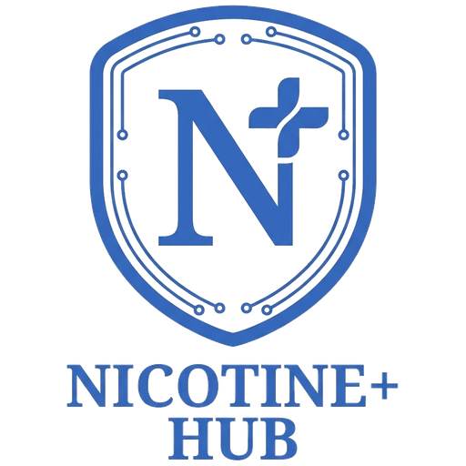

<h1 align="center">Nicotine Hub</h1>

<p align="center">
  
</p>

<p align="center">
  <a href="AI-DECLARATION.md"></a>
</p>

<p align="center">
  A <strong>mobile-first</strong> web client for the <a href="https://www.slsknet.org/">Soulseek</a> network.<br/>
  <em>Built predominantly with AI assistance under human review — see <a href="AI-DECLARATION.md">AI-DECLARATION.md</a>.</em>
</p>

## Demo

<p align="center">
  <strong>Try before you install → <a href="https://nicotine-hub-web-phi.vercel.app/">https://nicotine-hub-web-phi.vercel.app/</a></strong><br/>
  No bridge required. Enter any username/password to explore search, chat, profiles &amp; browse with mocked data.<br/>
  <em>Downloads/uploads are disabled in the demo.</em>
</p>

This is an almost 1:1 port of [nicotine-plus](https://nicotine-plus.org/) ([GitHub](https://github.com/nicotine-plus/nicotine-plus)) to a modern Next.js web app. Built on `doc/SLSKPROTOCOL.md`.

```
[ Browser (Next.js PWA) ] --WS JSON--> [ Bun bridge :8787 ] --TCP--> server.slsknet.org:2242
                                                         --P2P--> peers
```

The browser can't open raw TCP sockets, so the bridge translates JSON over WebSocket to Soulseek binary framing. See `docs/architecture.md` for protocol and env details.

> **Security:** Soulseek sends passwords in plaintext. The app never stores them — use credentials you trust.

---

## Features

- **Search** — global, user, room, wishlist & buddies; tabs + live filters (size/bitrate/length/type/slot/country)
- **Transfers** — queue, resume (`INCOMPLETE<md5>`), `GET /files/:token`, throttled streaming
- **Browse** — shares & folders via peers
- **Chat** — rooms + private, tickers, owned/member lists
- **Social** — buddies, interests/recommendations/similar users
- **Profiles** — description, picture, stats, privileges
- **Mobile shell** — `TopBar`/`BottomNav`, safe-area, PWA, diagnostics live tail

---

## Repo layout

```
apps/bridge  — Bun bridge  (WebSocket `/ws` + `/health` + `/files/:token` + volume `DATA_DIR`)
apps/web     — Next.js 15 PWA
compose.yaml — web:3000 + bridge:8787/62904 → bridge-data:/data
```

---

## Quick start

```bash
bun install
bun run dev              # bridge + web
bun test && bun run build
docker compose up --build  # http://localhost:3000 (build from source)
```

Bridge URL: `NEXT_PUBLIC_BRIDGE_URL` (build) or `localStorage.nicotine.bridgeUrl` (runtime). All env vars are documented in [`docs/architecture.md#env-full`](docs/architecture.md#env-full) — including `BRIDGE_TOKEN`, `DATA_DIR`, `LISTEN_PORT` (62904, editable in Settings → Network), `SHARED_DIRS`, `UPLOAD_LIMIT`, etc.

For prebuilt images and release workflow, see [`docs/deployment.md`](docs/deployment.md).

---

## Porting status

Stage `d395cc6` — almost 1:1, mobile-friendly. See **[docs/porting-status.md](docs/porting-status.md)** for the full domain-by-domain matrix, **[docs/settings-mapping.md](docs/settings-mapping.md)** for the settings map, and **`docs/settings-plan.md`** for done vs next (Phases A–G done, H: Network extras).

---

## Docs

- `docs/architecture.md` — bridge, search & protocol, WS JSON, `LISTEN_PORT`/`PortMapper`, env, tests
- `docs/porting-status.md` — matrix vs nicotine-plus 3.3.x
- `docs/deployment.md` — Docker & GHCR images, `TAG` pinning, promotion workflow (`stage` → `main`)
- `docs/settings-mapping.md` — authoritative Nicotine+ settings map
- `docs/settings-plan.md` — status (done A–G) vs next (H)
- `docs/DESIGN.md` — UI tokens
- `docs/plugins.md` — plugin system
- `AGENTS.md` — agent & worktree conventions

---

## Legal

**License:** [`GPL-3.0-or-later`](./COPYING). © 2001–2026 Nicotine+, PySoulSeek; © 2025–2026 nicotine-mobile. See [`ATTRIBUTION.md`](./ATTRIBUTION.md) (upstream `8d81e66`) and [`COPYING`](COPYING).

**Soulseek** network / `server.slsknet.org` is volunteer-operated and not affiliated with this project. By connecting you agree to the [Soulseek rules](https://www.slsknet.org/news/node/681) and [Terms](https://www.slsknet.org/news/node/682). Soulseek is unencrypted; see Security above.
